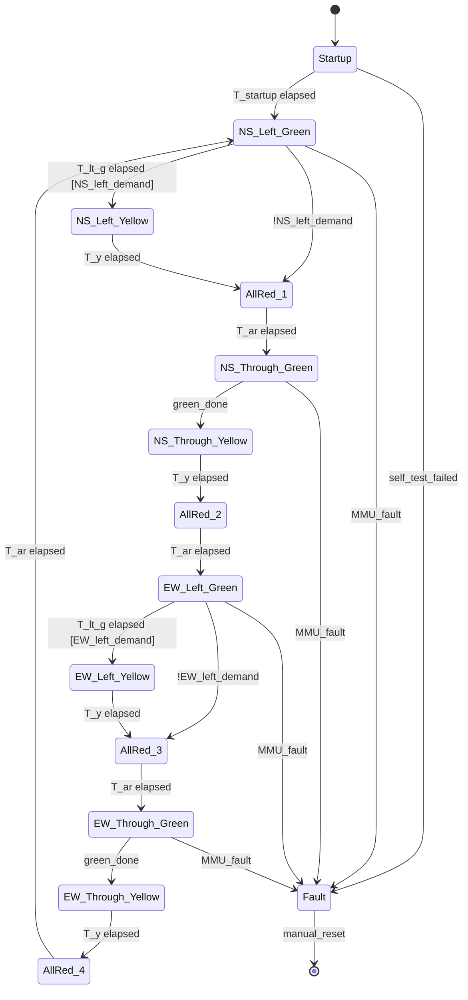
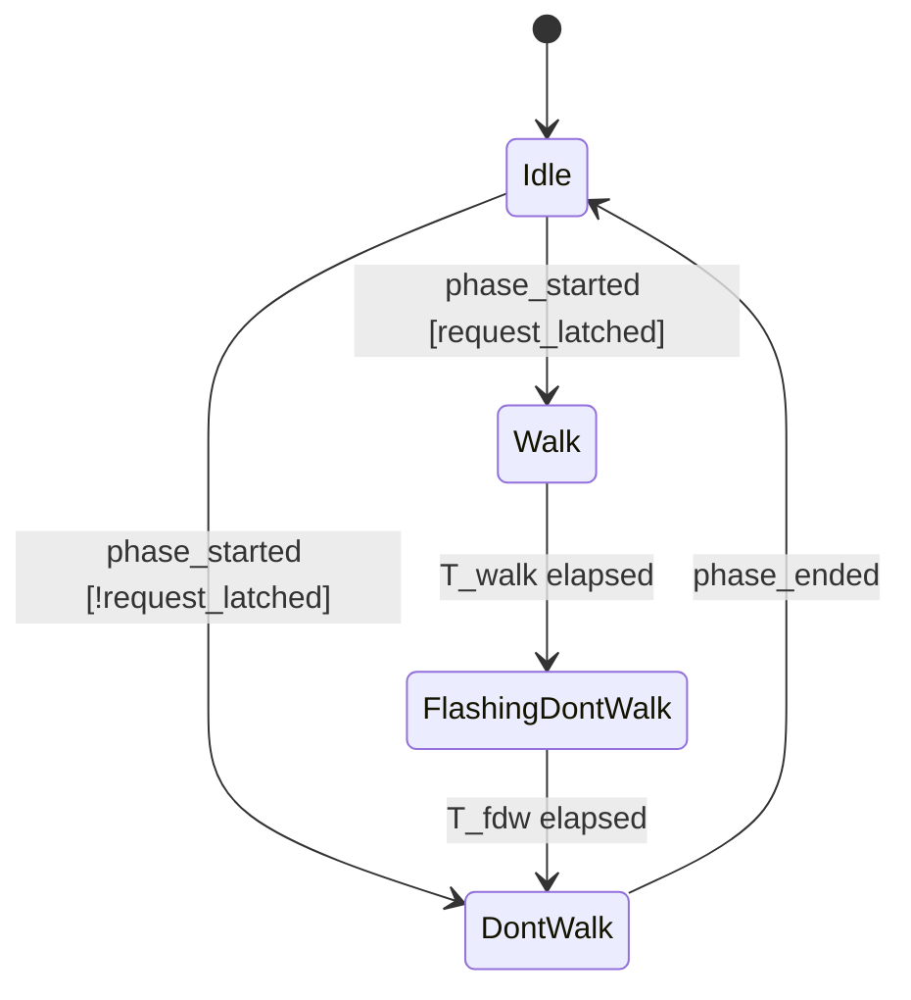

# Phase State Machine

The controller is a deterministic state machine. States correspond to phases
in the sequence; transitions are guarded by elapsed time and demand inputs.

## State diagram

## Guards

- `green_done` is true when **both** of the following hold:
  - Elapsed time in phase ≥ `T_min_g`
  - **and** (elapsed ≥ `T_max_g`, **or** no pedestrian phase active,
    **or** elapsed ≥ `T_walk + T_fdw`).
- `<demand>` flags are read from the demand-detection module; in v0.1, vehicle
  left-turn demand is treated as always-true via build flag.

## Pedestrian sub-state machine

The pedestrian indication runs in parallel with the corresponding through
phase:

## Invariants (proof targets)

These are the safety invariants the SPARK proof of the conflict-check module
will establish. They map to **FR-SF-01** and **FR-SF-02**.

1. **No conflicting greens/yellows**: For all pairs `(m1, m2)` such that
   `Conflict (m1, m2)` is true, never `Active (m1) and Active (m2)` where
   `Active` means showing green or yellow.
2. **No WALK during conflicting vehicle phase**: For all pedestrian phases
   `p` and movements `m` such that `Conflict (p, m)`, never
   `Walking (p) and Active (m)`.
3. **All-red gap honoured**: Between any two consecutive vehicle phases, the
   transition passes through a state where all vehicle indications are red,
   for at least `T_ar`.
