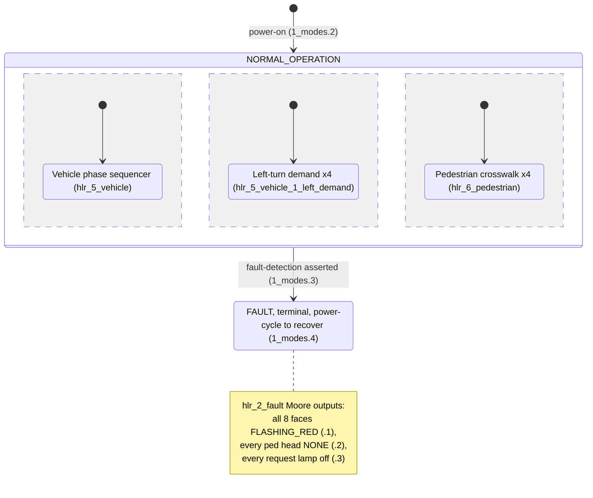
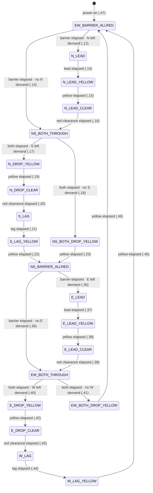
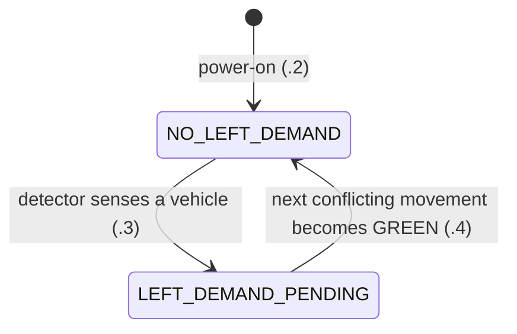
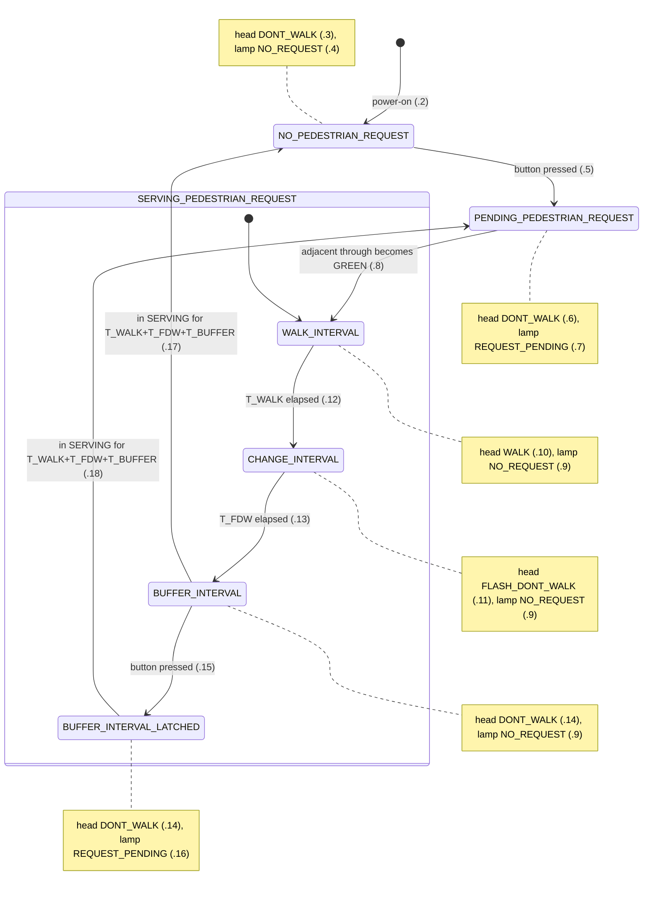
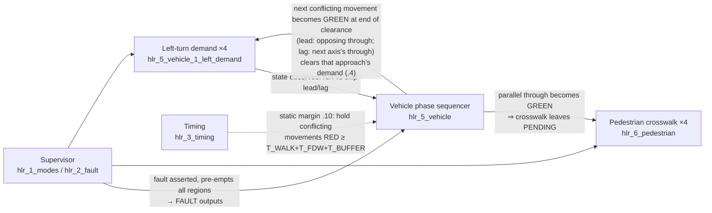

# Controller State Machines (Informative)

> **Non-normative.** This document renders the communicating Moore state
> machines defined by the HLRs in `hlr/` so they can be *seen*. The HLR YAML is
> the single source of truth — if a diagram and an HLR statement ever disagree,
> the HLR wins. Each diagram cites the statements it depicts (e.g. `.12` =
> statement 12 of that file).

The controller is a set of **communicating Moore state machines**: a top-level
supervisor (mode machine) contains three concurrent regions — one vehicle phase
sequencer, four left-turn demand machines, and four pedestrian crosswalk
machines. The machines couple by observing each other's named states and
signals; one coupling (pedestrian clearance) is discharged as a static timing
margin rather than a runtime handshake.

Conventions in the diagrams: **states** are named; **events** are prose on the
edges; transition guards appear after `·`; interval *durations* are named (never
inlined as numbers) and fixed in `hlr_3_timing`; signal *value sets* are fixed in
`hlr_4_signals`.

---

## 1. Hierarchy — the supervisor and its regions (`hlr_1_modes`, `hlr_2_fault`)

Two top-level modes. `NORMAL_OPERATION` contains the three regions as concurrent
sub-machines (detailed in §2–§4). A single fault edge pre-empts the entire
region; FAULT is terminal (recovery is an external power cycle).

---

## 2. Vehicle phase sequencer (`hlr_5_vehicle`)

One serialized Moore machine over both axes, alternating NS then EW, each through
a lead-lag protected-left structure. The two axes are exact mirrors; the
`*_BARRIER_ALLRED` state that ends one axis is the entry point for the other, so
the cycle closes. Power-on enters `EW_BARRIER_ALLRED` — the steady all-red barrier
that leads into NS (major-street) service via .12/.13 — so the cold start is steady
red then the major-street green (MUTCD 4G.04.01.B, since fault recovery is a power
cycle), and the barrier interval lets a waiting Northbound left be detected and
served via the lead.

### Phase sequence (both axes)

The two `*_BARRIER_ALLRED` states each lead into the other axis, so the cycle
closes within the one diagram: NS service ends at `NS_BARRIER_ALLRED`, which
enters EW service (.35/.36); EW service ends at `EW_BARRIER_ALLRED`, which
enters NS service (.12/.13).

### Moore outputs — NS states (statements `.2`–`.11`)

Every face is a function of state only. Each statement names its non-RED faces
and then **holds all other vehicle faces at RED** — so the four EW faces
(`E_thru`, `W_thru`, `E_left`, `W_left`) are explicitly RED in every NS state by
that clause (the two barrier states hold all eight at RED). The table shows only
the four NS faces; the four EW faces are RED in every row. The EW states mirror
this with N/S ↔ E/W swapped (`.25`–`.34`).

| State | N_thru | N_left | S_thru | S_left |
|-------|:------:|:------:|:------:|:------:|
| `N_LEAD` (.2)              | GREEN  | GREEN  | RED    | RED    |
| `N_LEAD_YELLOW` (.3)       | GREEN  | YELLOW | RED    | RED    |
| `N_LEAD_CLEAR` (.4)        | GREEN  | RED    | RED    | RED    |
| `NS_BOTH_THROUGH` (.5)     | GREEN  | RED    | GREEN  | RED    |
| `N_DROP_YELLOW` (.6)       | YELLOW | RED    | GREEN  | RED    |
| `N_DROP_CLEAR` (.7)        | RED    | RED    | GREEN  | RED    |
| `S_LAG` (.8)               | RED    | RED    | GREEN  | GREEN  |
| `S_LAG_YELLOW` (.9)        | RED    | RED    | YELLOW | YELLOW |
| `NS_BOTH_DROP_YELLOW` (.10)| YELLOW | RED    | YELLOW | RED    |
| `NS_BARRIER_ALLRED` (.11)  | RED    | RED    | RED    | RED    |

---

## 3. Left-turn demand machine (`hlr_5_vehicle_1_left_demand`, ×4 approaches)

A small per-approach machine with no output of its own; its state manifests in
whether the sequencer runs or skips that approach's protected left (guards `.12`,
`.17`, `.35`, `.40` above).

---

## 4. Pedestrian crosswalk machine (`hlr_6_pedestrian`, ×4 crosswalks)

`SERVING_PEDESTRIAN_REQUEST` is a superstate (the WALK → flashing-DON'T-WALK →
steady-DON'T-WALK buffer service is a timed sub-sequence), so it splits into
`WALK_INTERVAL`, `CHANGE_INTERVAL`, and the clearance buffer with the request-lamp
output hoisted to the superstate. The buffer is §3.5's ≥ `T_BUFFER` steady
DON'T-WALK before any conflicting movement is released; it sits *inside* the
superstate so the safety RED-hold `hlr_0_safety.1` (conditioned on
`SERVING_PEDESTRIAN_REQUEST`) covers it. Because the buffer's steady DON'T WALK is
indistinguishable from `NO_PEDESTRIAN_REQUEST` to a pedestrian, a press during it
latches (`BUFFER_INTERVAL_LATCHED`, lamp lit) and routes to
`PENDING_PEDESTRIAN_REQUEST` at buffer end so the call is served next cycle. Both
buffer exits fire on *time-in-SERVING* reaching `T_WALK + T_FDW + T_BUFFER`, so the
latch never resets the clearance clock.

---

## 5. Interactions between the machines

These are signal-observation couplings, not transitions of a single machine —
hence a flowchart, not a state diagram. Solid edges are runtime observations;
the dashed edge is the static timing margin that replaces a runtime handshake.

**Why the pedestrian coupling is a static margin, not a handshake.** The safety
obligation itself is the cross-machine invariant `hlr_0_safety.1` (CONOPS §3.4, §3.5):
while a crosswalk's pedestrian control machine is in `SERVING_PEDESTRIAN_REQUEST`,
every conflicting movement is held RED. Because through phases run a fixed-length slot (no gap-out,
`hlr_3_timing.7` and `hlr_3_timing.11`), every green onset and release time is known
at design time, so that invariant can be *discharged* by a static inequality on the
schedule (`hlr_3_timing.10`) instead of the sequencer observing live pedestrian
state. The invariant (the what) and its margin discharge (the how) are kept
separate so the fallback — a runtime coupling, if the inequality cannot be shown —
has somewhere to attach. Discharging the inequality against chosen durations, the
crosswalk → movement binding, and the fallback are one coupled LLR work item — see
`hlr_0_safety` rationale and `TODO.md`.
